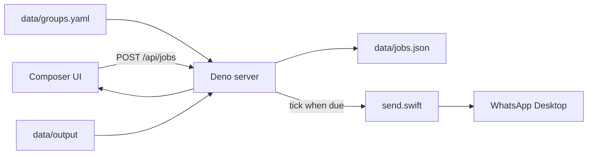

# WhatsApp automation app

Replace the script-catalog product with a two-column local app: **compose a send** on the left,
**scheduled jobs + log** on the right. The Deno process stays running (`deno task dev` / `start`)
and fires one-shot jobs from an in-process scheduler.



## Product shape

- **Group:** exact WhatsApp chat title from [`data/groups.yaml`](data/groups.yaml) (editable;
  reloaded on each request). Seed with the working example chat `tos/Ar—‘26.7`.
- **Message:** textarea (optional if a file is selected).
- **File:** pick one file under [`data/output/`](data/output/) (the five week-32 JPEGs today).
  Optional if a message is present. Require at least message or file.
- **Time:** `datetime-local`, interpreted as the machine’s local timezone. One-shot. Server sends
  even if the tab is closed.
- **Run:** spawn the Swift Accessibility script (not a generic script catalog). WhatsApp sends are
  **serialized** so two due jobs cannot drive the UI at once.

## Swift sender

Turn the working script into a CLI at [`data/whatsapp/send.swift`](data/whatsapp/send.swift). The
server writes a small JSON payload (avoids argv issues with fancy chat names and multiline text) and
runs:

`swift data/whatsapp/send.swift /path/to/payload.json`

Payload: `{ "chat": "...", "message": "...", "file": "absolute-or-empty" }`.

Keep the existing flow (open/activate WhatsApp, search/select chat, refuse if the header does not
match). Add attachment support:

1. Focus composer.
2. If `file` is set, put the file URL on `NSPasteboard`, Cmd-V, wait briefly for WhatsApp’s media
   preview.
3. If `message` is set, paste it as the caption / composer text.
4. Return to send.

Text-only sends stay on the current paste-then-Return path.

## Server

Keep [`src/main.ts`](src/main.ts) and the spawn/stream pattern in [`src/server.ts`](src/server.ts).
Drop script discovery from the request path.

Update [`src/config.ts`](src/config.ts): title, paths (`groups.yaml`, `data/output`,
`data/jobs.json`, Swift sender), drop script-runner column/window settings.

New modules (small, testable):

- [`src/groups.ts`](src/groups.ts) — parse YAML `{ groups: [{ name, label? }] }`.
- [`src/files.ts`](src/files.ts) — recursive list under `data/output`, skip dotfiles; serve bytes
  only if the resolved path stays inside that root.
- [`src/jobs.ts`](src/jobs.ts) — persist jobs; statuses
  `pending | running | sent | failed | canceled`.
- [`src/scheduler.ts`](src/scheduler.ts) — 1s tick: run due `pending` jobs one at a time; on boot,
  reload `data/jobs.json` and send overdue pending jobs immediately.

APIs:

| Method | Path            | Role                                   |
| ------ | --------------- | -------------------------------------- |
| GET    | `/api/app`      | groups, files, jobs, title             |
| GET    | `/api/files/*`  | image preview (path-safe)              |
| POST   | `/api/jobs`     | `{ groupName, message, file, sendAt }` |
| GET    | `/api/jobs`     | list (UI polls ~1s)                    |
| DELETE | `/api/jobs/:id` | cancel if still `pending`              |

Validate: known group, file under `data/output` (or empty), ISO `sendAt`, message and/or file. Reuse
stdout/stderr streaming internally into the job log (no floating terminal windows).

On shutdown (`stopAll`): kill a running Swift process; leave other pending jobs on disk for the next
server start.

## UI

Replace [`public/index.html`](public/index.html), [`public/app.js`](public/app.js), and most of
[`public/styles.css`](public/styles.css). Keep the dark monospace look and **shallow DOM** / stable
IDs ([AGENTS.md](AGENTS.md)).

```
main#app-shell
  section#composer-column
    header#app-header > h1#app-title
    select#group-select
    textarea#message
    div#file-list          (one selectable row per file; img thumbnail)
    input#send-at          (datetime-local)
    button#schedule
  section#jobs-column
    header#jobs-header
    div#job-list
    pre#job-log            (selected job’s Swift output)
```

File rows show folder + filename (`imgs/emp5_aaron_week32.jpg`). Selecting a JPEG shows a thumbnail
via `/api/files/...`. Poll `/api/jobs` while the page is open. Cancel pending jobs from the list.

## Remove script-runner catalog

The running app no longer discovers `_script.yaml`. Delete unused catalog code and examples so the
repo is not two products:

- [`src/scripts.ts`](src/scripts.ts), [`src/scripts_test.ts`](src/scripts_test.ts)
- [`data/scripts/`](data/scripts/) examples + homebrew
- [`data/shared/`](data/shared/) terminal helpers (unused)

Keep [`_other/scripts/serve.ts`](_other/scripts/serve.ts) and Deno tasks. Rewrite
[`src/server_test.ts`](src/server_test.ts) around `/api/app`, job validation, path traversal, and
HTML IDs. Add unit tests for YAML groups, file listing, and job persist/cancel.

Update [README.md](README.md) and [AGENTS.md](AGENTS.md): this is a local WhatsApp sender; WhatsApp
Desktop must be running/installed; macOS **Accessibility** must be granted to the process that
launches Deno (Terminal, Cursor, or `deno` itself), or the Swift AX calls fail.

## Out of scope (for now)

- Discovering chats from WhatsApp
- Recurring schedules
- Multiple attachments per send
- Editing `groups.yaml` in the UI (edit the file on disk)
